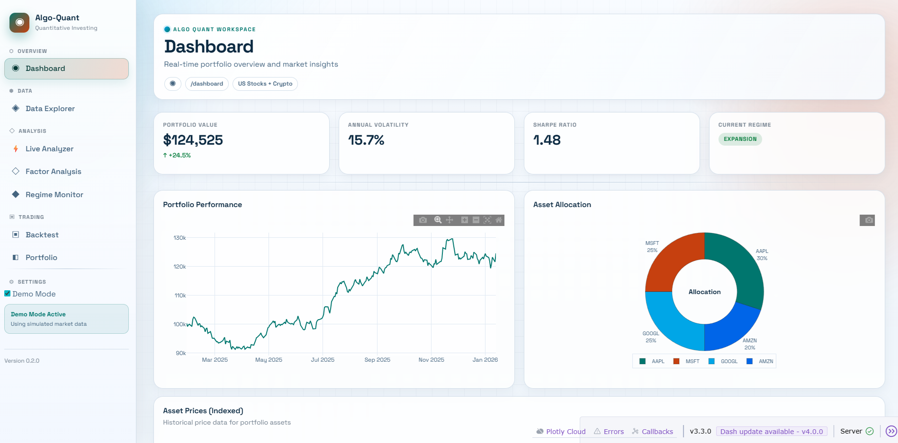
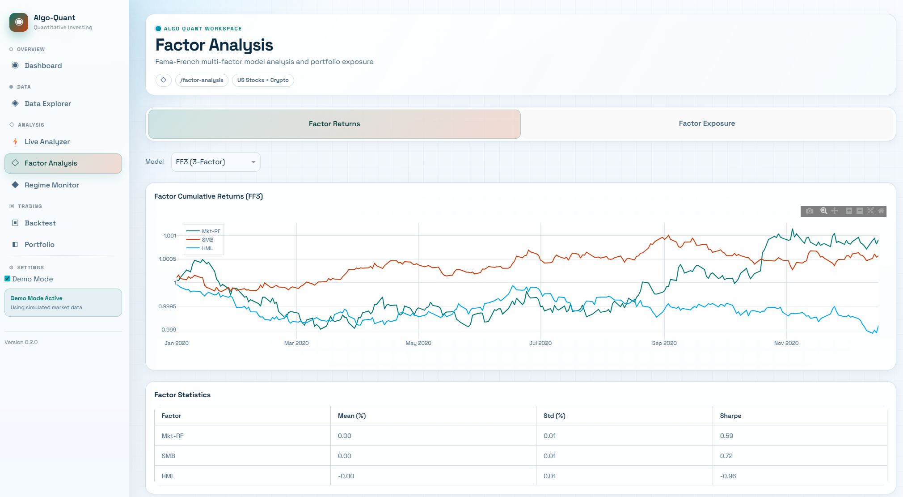

# algo-quant

퀀트 투자 자동화 에이전트 - Fama-French 멀티팩터 모델과 거시경제 체제 분류를 활용한 포트폴리오 관리 시스템

> GitHub Repository Description (recommended): Real-time quant trading research and paper-execution platform for US stocks and crypto, with factor/regime analytics and dashboard-driven screening.

[]()
[](https://www.python.org/downloads/)
[](https://opensource.org/licenses/MIT)
[]()

## 개요

algo-quant는 **국내/해외 주식 + 암호화폐**를 대상으로 한 통합 퀀트 투자 자동화 에이전트입니다.

### 주요 기능

- **다중 자산 지원**: 미국 주식, 한국 주식, 암호화폐 통합 관리
- **팩터 모델링**: CAPM, Fama-French 3팩터/5팩터 모델
- **거시경제 체제 분류**: FRED 지표 기반 경기 사이클 분석
- **자동화된 백테스팅**: Walk-forward 분석, 성과 지표 계산
- **실거래 연동**: Binance Paper Trading 지원
- **웹 대시보드**: Dash 기반 반응형 다크 테마 UI

## 지원 데이터 소스

| 카테고리 | 데이터 소스 | 기능 |
|----------|-------------|------|
| 미국 주식 | FMP API | 가격, 재무제표, 기업 프로필 |
| 미국 주식 (실시간) | Finnhub WebSocket | 실시간 체결 데이터 스트림 |
| 한국 주식 | 한국투자증권 (KIS) | 시세, 주문, 잔고 조회 |
| 한국 주식 | 키움증권 | 시세, 주문, 조건검색 |
| 거시경제 | FRED API | GDP, 실업률, 금리, 수익률곡선 |
| 암호화폐 | Binance | OHLCV, 주문, 잔고 (글로벌) |
| 암호화폐 | Upbit | OHLCV, 주문, 잔고 (국내) |

## 설치

### 요구사항

- Python 3.11 이상
- uv (권장) 또는 pip

### 설치 방법

```bash
# 저장소 클론
git clone https://github.com/your-username/algo-quant.git
cd algo-quant

# uv로 설치 (권장)
uv sync

# 또는 pip으로 설치
pip install -e .
```

### API 키 설정

```bash
# API 키 설정 파일 복사
cp config/api_keys.yaml.example config/api_keys.yaml

# api_keys.yaml 파일을 편집하여 API 키 입력
```

```bash
# 미국주식 실시간 스트림(Finnhub)용 .env 생성
cp .env.example .env

# .env 파일에서 FINNHUB_API_KEY 값을 실제 키로 교체
```

- `.env`는 Git에 커밋되지 않도록 기본 `.gitignore`에 포함되어 있습니다.
- 실수로 키를 외부(채팅/로그/스크린샷)에 노출했다면 즉시 재발급(rotate)하세요.

## 프로젝트 구조

```
algo-quant/
├── src/
│   ├── data/           # API 클라이언트 및 데이터 처리
│   │   ├── base_client.py    # 공통 HTTP 클라이언트
│   │   ├── fmp_client.py     # FMP API (미국 주식)
│   │   ├── fred_client.py    # FRED API (거시경제)
│   │   ├── kis_client.py     # 한국투자증권 API
│   │   ├── kiwoom_client.py  # 키움증권 API
│   │   ├── binance_client.py # Binance API
│   │   ├── upbit_client.py   # Upbit API
│   │   ├── preprocessor.py   # 데이터 전처리
│   │   └── cache.py          # 캐싱 시스템
│   ├── factors/        # 팩터 모델 (CAPM, FF3, FF5)
│   ├── regime/         # 경기 체제 분류
│   ├── strategy/       # 투자 전략
│   ├── backtest/       # 백테스팅 엔진
│   ├── execution/      # 실거래 시스템
│   └── ui/             # Dash 웹 대시보드
│       ├── components/ # 재사용 UI 컴포넌트
│       ├── layouts/    # 페이지 레이아웃
│       ├── callbacks/  # Dash 콜백
│       ├── services/   # 데이터 서비스
│       └── assets/     # CSS 스타일
├── tests/              # 테스트
├── config/             # 설정 파일
├── docs/               # 문서
│   ├── PRD.md          # 제품 요구사항
│   ├── TECH-SPEC.md    # 기술 설계서
│   └── PROGRESS.md     # 진행 현황
└── README.md
```

## 웹 대시보드

Dash 기반 반응형 웹 대시보드를 제공합니다.

| Dashboard | Factor Analysis |
|:-:|:-:|
|  |  |

```bash
# 대시보드 실행 (통합 CLI)
uv run aq dashboard --profile dev

# 실시간 데모 프로필
uv run aq dashboard --profile live

# 브라우저에서 접속
# http://localhost:8050
```

### 대시보드 기능

- **Dashboard**: 포트폴리오 현황, 핵심 지표
- **Live Analyzer**: Historical/Realtime 모드, Quant Screener
- **Data Explorer**: 주식/암호화폐/거시경제 데이터 탐색
- **Factor Analysis**: Fama-French 팩터 분석
- **Regime Monitor**: 경기 체제 모니터링
- **Backtest**: 전략 백테스팅
- **Portfolio**: 포트폴리오 관리 및 최적화

## 사용법

### 오프라인 페이퍼 트레이딩 데모

```bash
# API 키/네트워크 없이 동작하는 SMA 기반 페이퍼 트레이딩 시연
uv run aq paper-demo --profile paper --symbol AAPL --steps 120 --ma-window 20
```

### 파이프라인 실행

```bash
# 프로필 기본값(top/start)을 사용하는 파이프라인 실행
uv run aq pipeline --profile paper
```

### 기본 예제

```python
from src.data import FMPClient

# FMP 클라이언트 초기화
client = FMPClient(api_key="your_api_key")

# AAPL 주가 데이터 조회
prices = client.get_historical_prices("AAPL", start="2023-01-01", end="2024-01-01")
print(prices.head())

# 재무제표 조회
financials = client.get_financial_statements("AAPL", statement_type="income")
print(financials.head())
```

### 한국 주식 (한국투자증권)

```python
from src.data import KISClient

# KIS 클라이언트 초기화
client = KISClient(
    app_key="your_app_key",
    app_secret="your_app_secret",
    account_no="your_account",
    is_paper=True  # 모의투자
)

# 삼성전자 현재가 조회
price = client.get_price("005930")
print(price)
```

### 암호화폐 (Binance)

```python
from src.data import BinanceClient

# Binance 클라이언트 초기화
client = BinanceClient(
    api_key="your_api_key",
    api_secret="your_secret"
)

# BTC/USDT 일봉 데이터 조회
klines = client.get_klines("BTCUSDT", interval="1d", limit=100)
print(klines.head())
```

## 개발 현황

```
Phase 1: Data Infrastructure    [██████████] 100%
Phase 2: Factor Modeling        [██████████] 100%
Phase 3: Regime Classification  [██████████] 100%
Phase 4: Strategy Development   [██████████] 100%
Phase 5: Backtesting           [██████████] 100%
Phase 6: Production            [█████░░░░░] 47%
─────────────────────────────────────────────
Total Progress                  [█████████░] 91%
```

### 구현/진행 기능

| Phase | 주요 기능 |
|-------|----------|
| Phase 1 | FMP, FRED, KIS, Kiwoom, Binance, Upbit API 클라이언트, 캐싱 시스템 |
| Phase 2 | CAPM, Fama-French 3팩터/5팩터 모델, 팩터 중립화 |
| Phase 3 | FRED 지표 처리, HMM 체제 분류기, 시그널 생성 |
| Phase 4 | 포트폴리오 최적화 (Mean-Variance, Risk Parity), 체제 적응형 전략 |
| Phase 5 | 백테스팅 엔진, Walk-forward 분석, 벤치마크 비교 |
| Phase 6 | 실시간 스트림/리밸런서/브로커 어댑터/페이퍼 실행엔진 구현, 실거래 검증 및 알림 시스템 진행 중 |

### UI 기술 스택

- **Dash**: Callback 기반 반응형 UI
- **Plotly**: 인터랙티브 차트
- **Bootstrap**: 반응형 레이아웃
- **Dark Theme**: Claude 스타일 다크 테마
- **Responsive Design**: 모바일/태블릿 지원
- **Accessibility**: WCAG 준수, 키보드 네비게이션
- **Error Handling**: 사용자 친화적 에러 메시지
- **Caching**: DataService 캐싱으로 성능 최적화

## 테스트

```bash
# 전체 테스트 실행
uv run pytest

# 커버리지 포함
uv run pytest --cov=src --cov-report=term-missing
```

## 문서

- [PRD (제품 요구사항)](docs/PRD.md)
- [기술 설계서](docs/TECH-SPEC.md)
- [진행 현황](docs/PROGRESS.md)
- [GitHub 기록 운영 가이드](docs/GITHUB_WORKFLOW.md)

## 참고 자료

- [글로벌 퀀트 챔피언십 우승자와 함께 하는 퀀트 투자](https://fastcampus.co.kr/fin_online_quant01)
- [FMP API 문서](https://site.financialmodelingprep.com/developer/docs)
- [FRED API 문서](https://fred.stlouisfed.org/docs/api/fred/)
- [한국투자증권 API](https://apiportal.koreainvestment.com)
- [키움증권 Open API](https://openapi.kiwoom.com)
- [Binance API](https://binance-docs.github.io/apidocs)
- [Upbit API](https://docs.upbit.com)
- [Dash Documentation](https://dash.plotly.com/)

## 라이선스

MIT License
