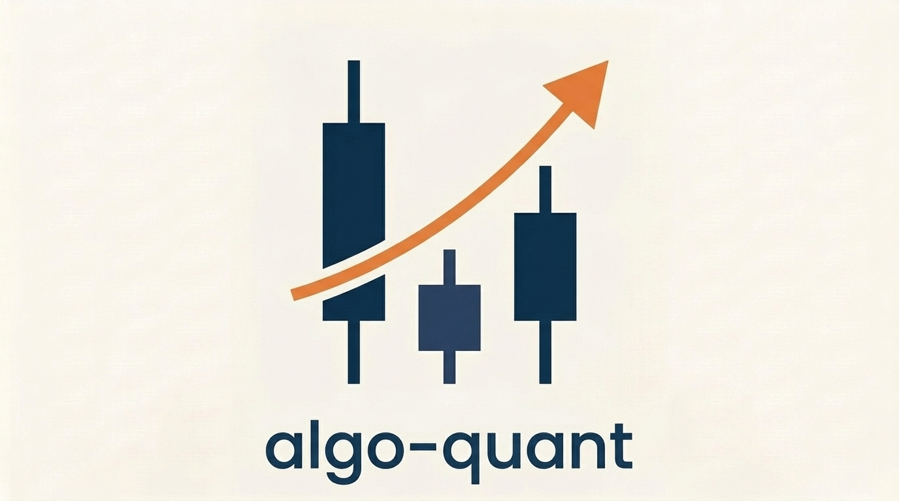

<div align="center">
  

  <h1>algo-quant</h1>
  <p><strong>Quantitative trading agent with multi-factor models, regime classification, and 5 API integrations</strong></p>

  <p>
    
    
    
    
    
  </p>
</div>

---

## Overview

algo-quant is an integrated quantitative investment automation agent targeting US stocks, Korean stocks, and cryptocurrency. It combines Fama-French multi-factor modeling with macroeconomic regime classification (HMM on FRED indicators) to drive portfolio management, walk-forward backtesting, and paper/live execution -- all accessible through a Dash-based dark-theme web dashboard.

## Key Features

- **Multi-Asset Coverage** -- US equities (FMP), Korean equities (KIS, Kiwoom), and crypto (Binance, Upbit) under one roof
- **Factor Modeling** -- CAPM, Fama-French 3-factor and 5-factor models with factor neutralization
- **Regime Classification** -- FRED-based macroeconomic regime detection using Hidden Markov Models
- **Walk-Forward Backtesting** -- Strategy validation with benchmark comparison and QuantStats reporting
- **Real-Time Execution** -- Finnhub WebSocket streaming, broker adapters, and Binance paper trading
- **Web Dashboard** -- 7-tab Dash UI (Dashboard, Live Analyzer, Data Explorer, Factor Analysis, Regime Monitor, Backtest, Portfolio)

## Data Sources

| Category | Provider | Capabilities |
|----------|----------|-------------|
| US Equities | FMP API | Prices, financials, company profiles |
| US Real-Time | Finnhub WebSocket | Live trade stream |
| Korean Equities | KIS, Kiwoom | Quotes, orders, balance |
| Macro | FRED API | GDP, unemployment, rates, yield curve |
| Crypto | Binance, Upbit | OHLCV, orders, balance |

## Tech Stack

| Category | Technologies |
|----------|-------------|
| Language | Python 3.11+ |
| Package Manager | uv (recommended), pip |
| Dashboard | Dash, Plotly, Bootstrap (dark theme) |
| Models | Fama-French (statsmodels), HMM (hmmlearn) |
| Execution | Binance API, KIS API, Kiwoom API |
| Data | FMP, FRED, Finnhub WebSocket |
| Testing | pytest |

## Development Status

```
Phase 1: Data Infrastructure     ██████████  100%
Phase 2: Factor Modeling          ██████████  100%
Phase 3: Regime Classification    ██████████  100%
Phase 4: Strategy Development     ██████████  100%
Phase 5: Backtesting              ██████████  100%
Phase 6: Production               █████░░░░░   47%
Phase 7: Integration Upgrade      ████████░░   85%
──────────────────────────────────────────────
Overall                           █████████░   90%
```

## Getting Started

```bash
# Clone and install
git clone https://github.com/your-username/algo-quant.git
cd algo-quant
uv sync          # or: pip install -e .

# Configure API keys
cp config/api_keys.yaml.example config/api_keys.yaml
cp .env.example .env
# Edit both files with your API credentials

# Launch dashboard
uv run aq dashboard --profile dev
# Open http://localhost:8050

# Run paper trading demo (no API keys needed)
uv run aq paper-demo --profile paper --symbol AAPL --steps 120
```

## Project Structure

```
algo-quant/
├── src/
│   ├── data/           # API clients (FMP, FRED, KIS, Kiwoom, Binance, Upbit)
│   ├── factors/        # CAPM, Fama-French 3F/5F models
│   ├── regime/         # HMM regime classifier, signal generation
│   ├── strategy/       # Portfolio optimization (MV, Risk Parity)
│   ├── backtest/       # Walk-forward engine, reporting
│   ├── decision/       # TradingAgents signal gateway
│   ├── execution/      # Broker adapters, paper trading engine
│   └── ui/             # Dash dashboard (components, layouts, callbacks)
├── tests/
├── config/
└── docs/
```

## License

MIT
